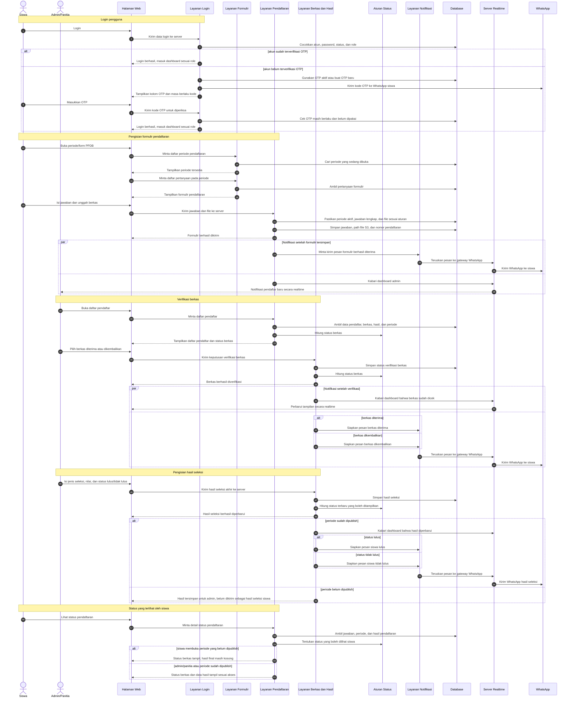

# Full System Flow - PSB Digital Architecture

Dokumen ini menjelaskan alur utama sistem PSB dengan bahasa proses: pengguna login, siswa mengisi formulir pendaftaran, admin/panitia memeriksa berkas, lalu admin/panitia mengisi hasil seleksi. Flow ini hanya memuat fitur yang dipakai pada proses utama.

## Catatan Arsitektur

1. **Halaman Web** dipakai siswa dan admin untuk mengirim data ke server.
2. **Layanan Login** menangani login, OTP, registrasi, reset password, dan token login.
3. **Layanan Pendaftaran** menyimpan jawaban siswa, path file dari bucket storage S3, dan nomor pendaftaran.
4. **Layanan Berkas dan Hasil** menangani verifikasi berkas dan hasil seleksi.
5. **Aturan Status** menentukan status yang boleh terlihat oleh siswa atau admin.
6. **Layanan Notifikasi** mengambil template WhatsApp dan mengirim pesan melalui gateway.
7. **Server Realtime** meneruskan perubahan status ke dashboard dan WhatsApp.
8. **Database utama** pada flow ini: `users`, `otps`, `tb_period`, `tb_questions`, `tb_answers`, `tb_results`, `notification_whatsapp_messages`, dan `tb_notification`.

## Aturan Visibility Hasil

Siswa tetap bisa melihat status berkas. Jika periode belum dipublish, hasil kelulusan belum ditampilkan ke siswa. Secara teknis backend mengosongkan field `selection_type`, `value`, dan `status` sampai `tb_period.is_published = true`. Admin/panitia tetap bisa melihat dan mengelola hasil sesuai kebutuhan operasional.

Route update hasil seleksi saat ini mengikuti kode backend: `PUT /api/respondent/result/upadte/{submissionId}`.
